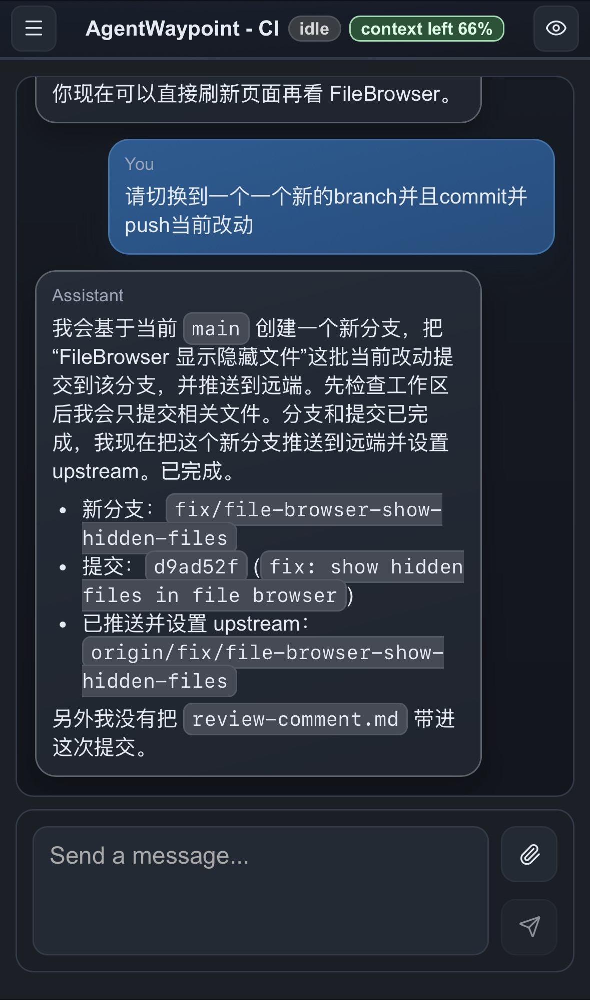
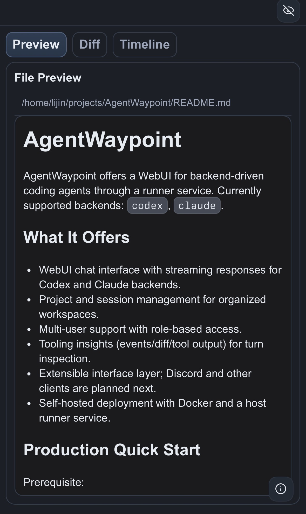
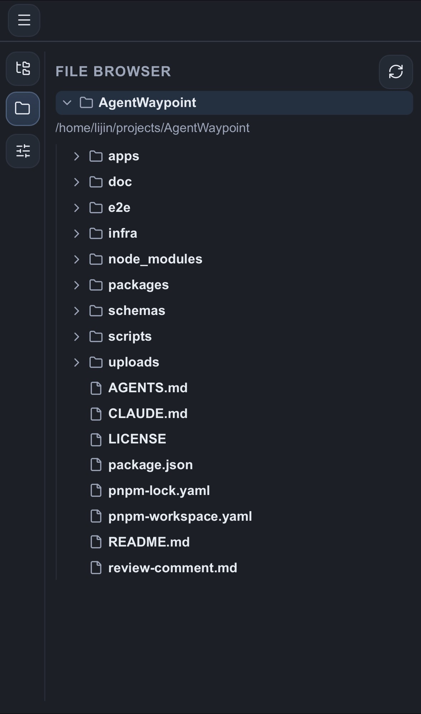
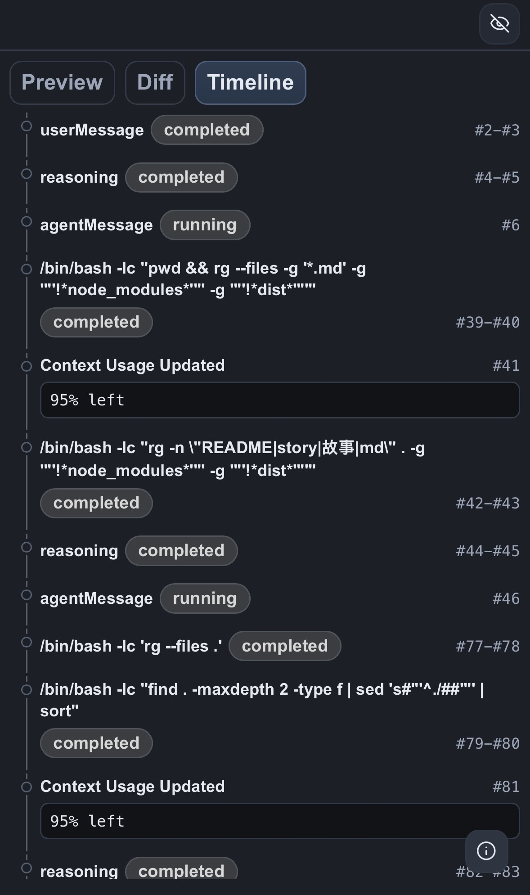
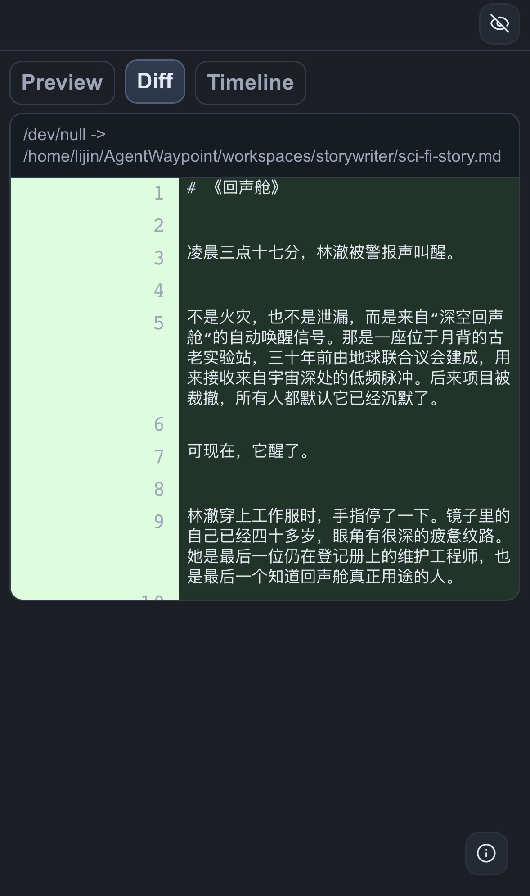

# AgentWaypoint

AgentWaypoint offers a WebUI for backend-driven coding agents. The lightweight runtime runs directly on the host with SQLite and an embedded runner; Docker, Redis, and Postgres are not required.

Currently supported backends: `codex`, `claude`.

## What It Offers
- WebUI chat interface with streaming responses for Codex and Claude backends.
- Project and session management for organized workspaces.
- Multi-user support with role-based access.
- Tooling insights for turn inspection, including events, diffs, and tool output.
- Workspace file browser, file previews, and uploads.
- Web and Discord channel plugins backed by an in-process channel gateway.
- Embedded runner mode for a single bare-metal service stack.

## Quick Start
Prerequisites:
- Bash
- Node.js `22.x` recommended
- `corepack` available for `pnpm`
- Codex CLI installed on host (`codex` in `PATH`) when using the Codex backend
- Claude runtime dependencies installed on host when using the Claude backend
- Login on host before startup for enabled backends

Install dependencies and build:
```bash
corepack pnpm install
corepack pnpm build
```

Start:
```bash
./agent-waypoint start
```

On first start, the CLI prompts for:
- data directory, defaulting to `~/.agentwaypoint`
- admin email and password
- API and Web ports, defaulting to `4000` and `3000`
- listen IP, defaulting to `0.0.0.0` (all IPv4 interfaces)

Open the printed URL, usually:
```text
http://localhost:3000
```

All service state lives under the selected data directory:
- `config.json`
- `agentwaypoint.db`
- `logs/`
- `workspaces/`

For development or test runs, use an isolated home so you do not touch a real service:
```bash
./agent-waypoint start --home ./.agentwaypoint-dev
```

## Operations
- Status: `./agent-waypoint status`
- Stop: `./agent-waypoint stop`
- Restart: `./agent-waypoint restart`
- Explicit SQLite integrity check: `./agent-waypoint check-db`
- Force web rebuild before start/restart: `./agent-waypoint restart --rebuild`
- Logs: `./agent-waypoint logs api` or `./agent-waypoint logs web`

`start` and `restart` automatically regenerate Prisma Client before database bootstrap. They also rebuild the web app when the existing `.next` build is missing or older than the web source/config inputs.

Compatibility wrappers are also available:
- `./scripts/dev-up.sh` uses `./.agentwaypoint-dev` unless `AGENTWAYPOINT_DEV_HOME` is set.
- `./scripts/prod-up.sh` uses `~/.agentwaypoint` unless `AGENTWAYPOINT_HOME` is set.

## Developer Docs
- [Developer Guide](./doc/Developer-Guide.md)
- [Architecture](./doc/Architecture-Initial.md)
- [Web/API/Runner Contract Inventory](./doc/Web-API-Runner-Contract-Inventory.md)
- [AGENTS runbook](./AGENTS.md)

## Screenshots






## License
Apache License 2.0. See [LICENSE](./LICENSE).
