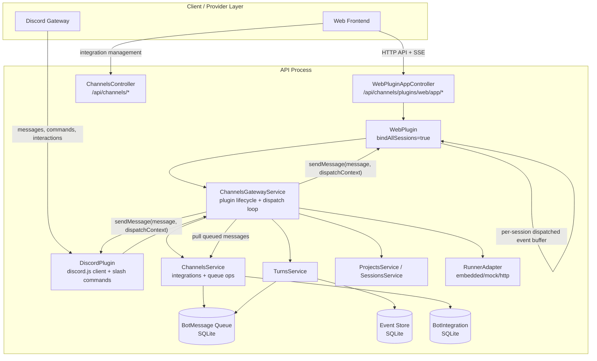

# Channels Gateway Architecture

Last aligned with implementation: 2026-05-11

## Current Model

- The channel gateway runs inside the API process.
- Plugins are Nest providers booted by `ChannelsGatewayService`.
- Implemented plugins:
  - `WebPlugin`
  - `DiscordPlugin`
- `BotMessage` is the active outbound queue table.
- Runner events are persisted to `Event`; `BotMessage(kind=event)` stores an `eventId` outbox reference, which the gateway hydrates before plugin dispatch.
- Dispatch routing is binding-driven:
  - Web plugin binds all sessions.
  - Discord bindings live in `BotIntegration.pluginConfig`.
- No `/api/channels/gateway/*` externalized HTTP controller is implemented.

## Web Plugin Flow

- Web UI calls `/api/channels/plugins/web/app/*`.
- Controller delegates to `WebPlugin`.
- `WebPlugin` delegates through `ChannelPluginContext`.
- The context calls core services for projects, sessions, turns, models, skills, filesystem, and event streams.
- Web SSE merges persisted DB events with the web plugin's latest-turn in-memory dispatch buffer.

## Discord Plugin Flow

- Discord integrations are stored as `BotIntegration(provider="discord")`.
- Credentials/config come from `credentialsEncrypted` and `pluginConfig`.
- The plugin uses `discord.js` Gateway mode.
- Supported commands include:
  - `/project`
  - `/session`
  - `/cancel`
  - `/fs`
- Inbound Discord messages can create turns after trigger/user/guild/channel policy checks.
- Outbound turn messages/events are dispatched back to Discord through `BotMessage`.
- Approval requests use Discord select menus where possible.

## Known Limits

- Plugin runtime state is in-memory.
- Queue retry/backoff is basic compared with the larger future gateway design.
- Dedicated binding tables are not implemented.
- Externalized gateway M2M auth is not implemented.
- Credentials are stored as JSON payloads; envelope encryption is a future hardening task.
