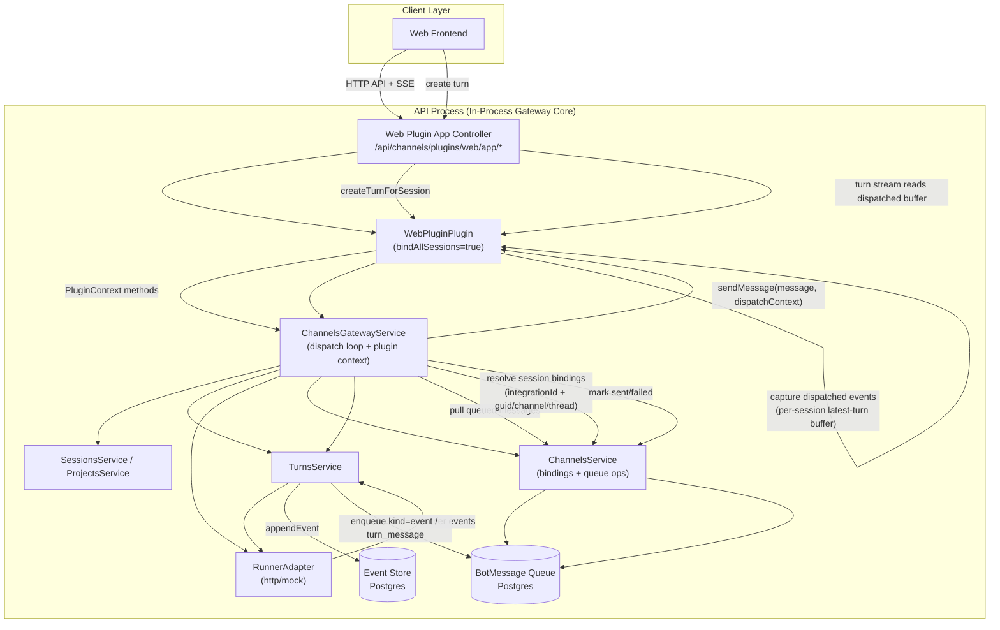

# Channels Gateway Architecture (Current)

## Notes
- Web plugin no longer reads turn SSE directly from `Event` table; stream is fed by gateway-dispatched messages captured by web plugin.
- Dispatch routing is binding-driven (session bindings + plugin `bindAllSessions` policy), not identifier parsing.
- Dispatch context includes structured trigger metadata:
  - `triggerProvider`
  - `triggerIntegrationId`
  - `isTriggeredByYou`
  - binding target fields (`integrationId`, `guid`, `channel`, `thread`)

