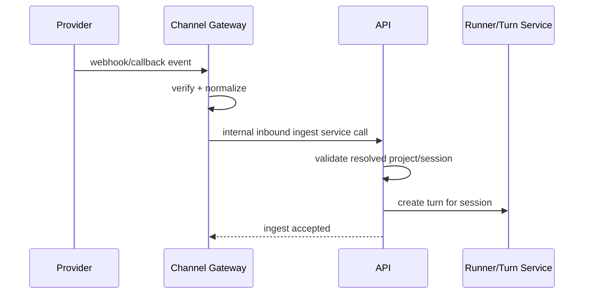
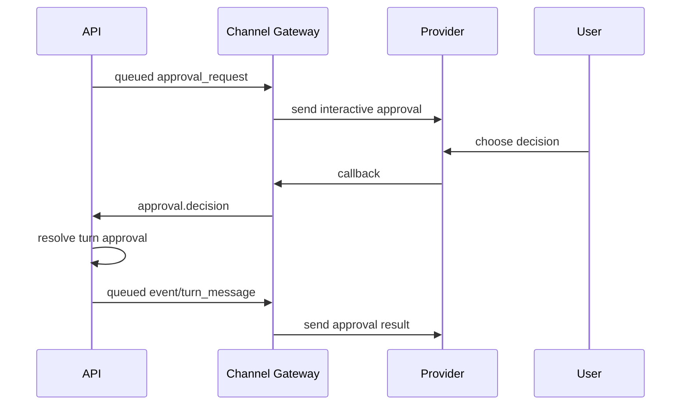

# Third-Party Bot / Channel Integration Design

## Implementation Snapshot (2026-04-03)
- Default runtime mode is in-process only (inside API). No separate gateway container/process is used.
- Web is implemented as a plugin (`web` provider) with `bindAllSessions=true`.
- Web frontend chat/session/project/models/skills/fs flows call `/api/channels/plugins/web/app/*`.
- Gateway dispatch is binding-driven:
  - resolves bound integrations from `BotIntegration.pluginConfig`
  - passes structured dispatch context to plugins (`bindingIntegrationId`, `guid`, `channel`, `thread`, trigger metadata)
  - does not parse provider/integration from `unifiedIdentifier`.
- Trigger origin metadata is explicit:
  - inbound accepts `triggerProvider` + `triggerIntegrationId`
  - turn persists `triggerIdentifier`, `triggerProvider`, `triggerIntegrationId`, `triggerMessageId`.
- Outbound pipeline is active through `BotMessage` queue (`pull -> claim -> send -> report`).
- Runner events are persisted to `Event` and also enqueued as `BotMessage(kind=event)` for dispatcher delivery.
- Web SSE currently merges:
  - durable DB events (`Event` table replay), and
  - dispatcher-delivered in-memory plugin buffer (per-session latest-turn).
- Legacy/optional externalized compatibility endpoints under `/api/channels/gateway/*` are not used in current flow.

## 1. Goals and Non-goals

### Goals
- Support provider plugins without locking final provider list at this stage.
- Validate architecture early with one pilot real provider plus one mock provider.
- Allow bot-side incoming messages to map to internal `project` + `session`.
- Allow rebinding from external conversation scope to another internal session.
- Support platform hierarchy:
  - Bot integration
  - Sub-channel (Discord channel / group / DM)
  - Sub-thread (Discord thread)
- Allow backend to proactively send outbound messages to external channels.
- Web can manage channels and integration lifecycle.
- Reserve multi-step auth/login flow for platforms like WeChat (QR -> scan -> token).

### Auth Priority
- Auth workflow is lower priority in current implementation order.
- Implement auth flow only when onboarding a provider that actually requires it.

### Non-goals (current phase)
- Do not fully implement provider SDK adapters now.
- Do not implement full webhook signature verification now.
- Do not implement full retry/monitoring UI now.

## 1.1 Naming Convention (to avoid confusion)
- `Bot*` entities represent API-owned integration/auth models (for example `BotIntegration`, `BotAuthSession`).
- `channel/thread` words represent provider-native conversation containers (Discord channel/thread, group chat, DM).
- API path prefix remains `/api/channels/*` as the product domain entry point, while internal model names use `Bot*`.

## 2. Deployment Topology

### 2.1 Containers
- `api`: business API service.
- `web`: management UI.
- Channel gateway/plugin runtime is hosted inside `api` container/process (no separate gateway container in default deployment).

### 2.2 Responsibility boundaries
- `api` owns source of truth for integration config/credentials, project/session entities, generic outbound queue, inbound ingest endpoints, file storage service, and channel runtime orchestration.
- channel runtime (inside `api`) owns provider protocol handling (websocket/webhook/long-poll), routing/mapping (integration-channel-thread), identity/rule evaluation, and outbound dispatch.
- `web` only calls `api`, never calls provider directly.

### 2.3 Port strategy
- Do not open one port per provider.
- Use API service ingress for provider callbacks and channel management endpoints.
- API exposes unified `/api/channels/*`; provider differences are internal adapter differences.
- Existing workspace file endpoints (`/api/fs/upload`, `/api/fs/file-content`) are not used by gateway channel traffic.
- Channel runtime file operations use dedicated channel-domain file-ingest service paths.
- Externalized mode may expose compatibility endpoints under `/api/channels/gateway/files/*`.

### 2.4 File storage model (no physical isolation)
- Channel files and workspace files both live under the user project workspace filesystem.
- No separate bucket/prefix isolation is required in MVP.
- Isolation is contract/permission based, not physical storage based:
  - `/api/fs/*` for workspace operations
  - `/api/channels/*` for bot-channel attachment operations

### 2.4.1 Storage access control
- `storageKey` must include `projectId`-scoped path segment under workspace uploads.
- Storage access checks validate project/workspace ownership and integration ownership.
- Gateway receives storage references only and cannot use path traversal to access unrelated files.

## 3. Domain Model

Add a new bounded context: `channels`.

### 3.1 Core entities

1) `BotIntegration`
- One registered bot integration owned by user.
- Fields:
  - `id`, `ownerUserId`
  - `provider` (string, extensible; examples: `discord`, `wechat`, `feishu`)
  - `name`
  - `status` (`draft` | `authorizing` | `active` | `paused` | `error` | `disabled`)
  - `credentialsEncrypted` (JSON, encrypted)
  - `pluginConfig` (JSON, provider-specific config payload)
  - `lastSyncAt`, `lastErrorAt`, `lastErrorMessage`
  - `createdAt`, `updatedAt`

2) `BotMessage`
- Generic outbound queue job (API does not interpret provider message semantics).
- Fields:
  - `id`, `projectId`, `sessionId`
  - `kind` (`turn_message` | `approval_request` | `user_input_request` | `event`)
  - `payloadRaw` (opaque message payload for plugin/provider)
  - no attachment metadata in queue payload
  - `status` (`queued` | `sending` | `sent` | `delivered` | `failed`)
  - `attemptCount`, `nextAttemptAt`
  - `errorCode`, `errorMessage`
  - `createdAt`, `sentAt`, `deliveredAt`

3) `BotAuthSession`
- Multi-step auth flow state machine.
- Fields:
  - `id`, `botIntegrationId`, `provider`
  - `status` (`pending` | `challenge_ready` | `waiting_user_action` | `authorized` | `expired` | `failed` | `cancelled`)
  - `challengeType` (`qr_code` | `oauth_url` | `device_code` | `manual_code`)
  - `challengePayload`, `resultPayload`
  - `expiresAt`, `lastPolledAt`
  - `createdAt`, `updatedAt`

4) `ChannelFile`
- Generic file storage reference (independent from message queue semantics).
- Fields:
  - `id`, `projectId`, `sessionId`
  - `storageProvider` (`local` only)
  - `storageKey` (workspace-relative path, format: `uploads/channels/{projectId}/{yyyy}/{MM}/{uuid}`)
  - `fileName`, `mimeType`, `sizeBytes`
  - `checksumSha256` (nullable)
  - `createdAt`

Channel-runtime-owned state (not API-domain tables):
- provider channel/thread map to internal `{projectId, sessionId}`
- provider user identity mapping and authorization rules
- adapter-local routing/index caches

## 4. API Contract (`/api/channels/*`)

All user-facing endpoints below are under `AuthGuard` (user session).

### 4.1 Integrations
- `POST /api/channels/integrations`
  - create draft integration
- `GET /api/channels/integrations`
  - list current user integrations
- `GET /api/channels/integrations/:botIntegrationId`
  - detail
- `PATCH /api/channels/integrations/:botIntegrationId`
  - update name/config/status-intent
- `POST /api/channels/integrations/:botIntegrationId/activate`
- `POST /api/channels/integrations/:botIntegrationId/pause`
- `POST /api/channels/integrations/:botIntegrationId/disable`
- `DELETE /api/channels/integrations/:botIntegrationId`

### 4.2 Auth flow (multi-round)
- `POST /api/channels/auth/preflight`
  - start auth before integration exists; returns `authSessionId`, optional challenge payload
- `GET /api/channels/auth-sessions/:authSessionId`
  - poll status + challenge payload
- `POST /api/channels/auth-sessions/:authSessionId/submit`
  - submit manual code/device code when needed
- `POST /api/channels/auth-sessions/:authSessionId/cancel`
- `POST /api/channels/integrations`
  - create integration with `authSessionId`; commit credentials only on create success
- `POST /api/channels/integrations/:botIntegrationId/auth/start`
  - start re-auth for existing integration; returns `authSessionId`
- `POST /api/channels/integrations/:botIntegrationId/auth/commit`
  - commit re-auth credentials atomically to existing integration

### 4.2.1 OAuth callback architecture
- API-hosted callback endpoint pattern:
  - `/callbacks/:provider/:authSessionId`
- Callback endpoint is served by API channel module.
- `state` contains signed nonce + `authSessionId` + expiration timestamp.
- Channel runtime receives OAuth `code`, exchanges token through provider API, and stores credential result on `BotAuthSession` (pending, not yet committed to integration credentials).

State signing detail:
- state payload format: `{authSessionId}:{expiryTimestamp}:{nonce}`.
- signature: `HMAC-SHA256(OAUTH_STATE_SECRET, statePayload)`.
- transmitted value: `base64url(statePayload).base64url(signature)`.

### 4.2.3 Credential commit semantics
- Pre-create auth:
  - callback success updates only `BotAuthSession.resultPayload`.
  - credentials are committed to integration row only when user submits create with `authSessionId`.
- Re-auth:
  - callback success updates only `BotAuthSession.resultPayload`.
  - `auth/commit` atomically replaces integration credentials.
- Safety:
  - existing credentials remain active until commit succeeds.
  - failed commit does not overwrite previous credentials.

### 4.2.2 Auth timeout policy
- QR/device code TTL: 5 minutes (or provider lower bound).
- Poll interval: 5 seconds.
- On timeout, `BotAuthSession.status = expired`.
- API cleanup job archives/deletes stale pending auth sessions older than 24 hours.

### 4.3 Topology and binding policy
- API does not own topology or binding resources.
- No API-side endpoint/thread/binding CRUD in this design.
- Gateway/plugin owns mapping and resolution and submits resolved `{projectId, sessionId}` events to API.

### 4.4 Outbound queue and dispatch
- `POST /api/channels/messages/send`
  - create outbound queue job (target: `projectId`, `sessionId`)
- `POST /api/channels/messages/send-approval`
  - create approval-style outbound queue job (`projectId`, `sessionId`)
- `POST /api/channels/messages/:messageId/retry`
- `GET /api/channels/messages?projectId=...&sessionId=...&status=...&direction=...`
- `GET /api/channels/messages/:messageId`

### 4.4.1 File-send marker convention
- Agent-requested file send is expressed in message content with marker:
  - `<send_file>(relative-or-absolute-path)</send_file>`
- API enqueues marker-containing `turn_message`/`event` payload only; no attachment object is included.
- Consumers parse marker and apply channel-specific behavior.

### 4.5 Internal channel runtime service contract (default)
- Channel runtime calls API modules/services directly (no internal HTTP required).
- Required internal operations:
  - ingest resolved inbound event (`projectId`, `sessionId`)
  - pull/claim/report outbound jobs
  - fetch active integration snapshots
  - update heartbeat/liveness
  - ingest/register channel files and return workspace-relative reference
- Supported inbound event types:
  - `message.created`
  - `approval.decision`
  - `file.uploaded`
  - `interaction.observed` (informational only, no API-side command execution)

### 4.6 Optional compatibility HTTP endpoints (externalized mode only)
- Keep `/api/channels/gateway/*` only for externalized runtime mode.
- In default in-process mode, these endpoints should be disabled or internal-only/non-routable.

## 5. Channel Runtime <-> Provider Adapter Interface

Channel runtime internal interface (TypeScript shape):

- `provider(): ProviderType`
- `boot(ctx: ProviderBootContext): Promise<void>`
  - initialize SDK client, restore session/token, start listeners using credentials + provider-specific config
- `shutdown(): Promise<void>`
- `startAuth(input: StartAuthInput): Promise<AuthChallenge>`
- `pollAuth(input: PollAuthInput): Promise<AuthProgress>`
- `exchangeAuth(input: ExchangeAuthInput): Promise<CredentialsResult>`
- `refreshCredentials(input: RefreshCredentialsInput): Promise<CredentialsResult>`
- `sendMessage(input: SendMessageInput): Promise<SendMessageResult>`
- `parseInboundEvent(raw: unknown): Promise<NormalizedInboundEvent[]>`
- `verifyCallback?(rawRequest): Promise<boolean>`

Normalized inbound event required fields:
- `provider`, `projectId`, `sessionId`
- `providerEventId`
- `eventType` (`message.created` | `approval.decision` | `file.uploaded` | `interaction.observed`)
- optional provider metadata passthrough (for example external channel/thread/message ids)
- `content`, `payloadRaw`, `occurredAt`
- `attachments` (optional):
  - `fileName`, `mimeType`, `sizeBytes`
  - optional provider metadata passthrough in `payloadRaw`

Identity mapping note:
- Provider-user identity parsing and authorization mapping are plugin-owned policies.
- Gateway core does not require a unified `externalUserId` field in normalized events.

## 6. Internal Service Boundary and Optional External Auth

Default mode:
- gateway runtime is an internal API service/module.
- no gateway-to-API network auth is required.
- authorization is enforced at external boundaries only (user auth and provider callback verification).

Externalized mode only:
- if runtime is moved out of API process, use M2M auth for `/api/channels/gateway/*`.

### 6.1 Auth method (externalized mode)
- Use service-to-service machine identity, not user cookie.
- Recommended: short-lived JWT access token via `client_credentials`.
- Optional hardening: mTLS between gateway and api.

### 6.2 Token issuing (externalized mode)
- Gateway uses `CHANNEL_GATEWAY_CLIENT_ID` + `CHANNEL_GATEWAY_CLIENT_SECRET`.
- Exchange at API auth endpoint:
  - `POST /api/channels/gateway/token`
- API returns `access_token`, `expires_in`, `scope`.

### 6.3 Scope model (externalized mode)
- `channels.gateway.read_integrations`
- `channels.gateway.pull_outbound`
- `channels.gateway.write_inbound`
- `channels.gateway.write_delivery`

### 6.4 Runtime behavior (externalized mode)
- Gateway refreshes token before expiry (e.g. 20% TTL remaining).
- On `401/403`, gateway forces refresh once and retries idempotent request.
- API validates JWT scope plus `projectId/sessionId` ownership constraints.
- Optional hardening mode: include allowed integration list in JWT claims and enforce claim check per request.

### 6.5 Credential responsibility and key management
- API stores provider credentials encrypted at rest (envelope encryption).
- API is responsible for decrypting persisted credentials for runtime dispatch.
- In default in-process mode, channel runtime reads decrypted runtime credential material via internal service/module call boundaries.
- Channel runtime does not hold database encryption master keys independently from API secret-management boundary.
- Key injection:
  - API key material is injected via secret manager or environment variable at boot.
- Externalized mode only: gateway receives M2M auth secrets (`CHANNEL_GATEWAY_CLIENT_ID/SECRET`).
- Future optional mode:
  - Gateway-side unwrap via KMS can be added later, but is out of MVP scope.

### 6.5.1 Credential encryption specification
- Algorithm: AES-256-GCM.
- Key source:
  - Preferred: cloud KMS data key flow.
  - Self-hosted fallback: `CHANNEL_CREDENTIALS_KEY`.
- Rotation:
  - rotate every 90 days.
  - run re-encryption job for persisted credential rows.

### 6.5.2 Provider token refresh
- Gateway checks provider token expiry before send/receive actions.
- Adapter refresh entrypoint: `refreshCredentials()`.
- API persists refreshed token and expiry as source of truth.
- Refresh failure policy:
  - set `BotIntegration.status = error`
  - write `lastErrorMessage`
  - emit alert event.

### 6.5.3 Token refresh concurrency
- Gateway enforces per-`botIntegrationId` refresh lock.
- Only one refresh operation per integration can run at a time.
- Concurrent requests wait for refresh result or use short grace-period token if still valid.

## 7. Channel Runtime Sync Strategy (In-API Deployment)

## 7.1 Startup full pull
1. API boots channel runtime.
2. Channel runtime loads active integrations page-by-page (service call or equivalent endpoint path).
3. For each integration:
   - load adapter instance
   - receive runtime credentials from API
   - `boot()` provider adapter
   - initialize provider-specific routing state inside gateway/plugin store

## 7.2 Event-driven integration reload (web add/edit bot)

When user creates/updates/activates a bot integration from Web, API should emit integration lifecycle events so channel runtime can hot-load without restart.

Trigger points (API write success):
- create integration -> emit `integration.created`
- update integration -> emit `integration.updated`
- activate integration -> emit `integration.activated`
- pause/disable/delete integration -> emit `integration.paused|disabled|deleted`

Event payload (minimum):
- `eventId`
- `eventType`
- `botIntegrationId`
- `ownerUserId`
- `version` (monotonic revision or updatedAt)
- `occurredAt`

Channel runtime handling:
1. consume lifecycle event from queue/topic
2. fetch latest integration snapshot from API
3. reconcile adapter instance:
   - create/start when activated
   - hot-reload credentials/config when updated
   - stop/unregister when paused/disabled/deleted
4. report handling result (ack/fail) for retry visibility

Fallback:
- keep periodic incremental pull (`updatedAfter`) and periodic full reconcile, so missed notifications are recovered automatically.

Implementation options:
- Option A (MVP default): API writes `integration_lifecycle_events` table, gateway polls and consumes.
- Option B: Redis pub/sub.
- Option C: WebSocket push from API.

### 7.2.1 Horizontal scaling and leader election
- Initial mode: single API instance with embedded channel runtime.
- Multi-instance mode:
  - all API instances can consume queue work with claim/lease semantics.
  - only leader runs periodic full reconcile jobs.
- Leader election options:
  - PostgreSQL advisory lock (recommended for MVP).
  - Redis lock (optional future mode).
- Future sharding mode:
  - partition by `hash(botIntegrationId)` for stable ownership.

## 7.3 Incremental sync
- Poll integration snapshots (`updatedAfter`) every N seconds.
- Add/update/remove in-memory adapter instances by version.
- Keep periodic full reconcile (e.g. every 10 minutes) to prevent drift.
- Defaults:
  - incremental poll interval: 30 seconds (`CHANNEL_GATEWAY_POLL_INTERVAL_SECONDS`)
  - full reconcile interval: 10 minutes (`CHANNEL_GATEWAY_FULL_RECONCILE_SECONDS`)

## 7.4 Outbound pull-dispatch loop
1. Pull queue jobs via internal service call.
2. Claim each message with lease.
3. Call provider `sendMessage`.
4. Report result via internal service call.
5. API handles retry/backoff scheduling.

### 7.4.1 Provider circuit breaker
- Scope: per `botIntegrationId`.
- Defaults:
  - open breaker after 5 consecutive failures.
  - half-open probe after cool-down.
  - close after 3 consecutive probe successes.
- Backoff curve: `1s -> 2s -> 4s -> 8s -> 16s -> 32s(max)`.
- Open breaker only blocks that integration; other integrations continue dispatch.

## 7.5 Inbound ingest loop
- Provider callback/socket event -> adapter `parseInboundEvent` ->
  internal ingest service call.
- Plugin resolves routing/mapping before ingest and submits `projectId` + `sessionId`.
- API validates ownership and writes inbound message/turn side effects.

## 7.6 Event queue model (gateway-first normalize)

All provider callbacks/events should be pushed to queue, with gateway doing first-pass parse/normalize before plugin actions.

Queue layers:
- `channels_raw_event_queue`
  - raw provider payloads, trace and replay purpose.
- `channels_normalized_event_queue`
  - gateway-normalized events in unified schema.
  - plugins consume this queue and decide plugin-specific actions.
- `channels_action_queue`
  - explicit platform actions generated by core policies or plugin decisions (send message, resolve approval).
  - includes integration lifecycle actions (`integration.created/updated/activated/paused/disabled/deleted`) to trigger gateway reload.

Implementation recommendation (MVP):
- Use database-table-backed queues (PostgreSQL) first.
- Claim semantics via `SELECT ... FOR UPDATE SKIP LOCKED` + lease fields.
- Delivery semantics: at-least-once.
- Required behaviors:
  - claim/ack/fail
  - retry with backoff via `nextAttemptAt`
  - dead-letter transition after max attempts
- Optional future upgrade: Redis Streams or Kafka when throughput demands increase.

### 7.6.1 Delivery semantics
- End-to-end guarantee is at-least-once.
- Exactly-once is not guaranteed due to external provider constraints.
- Idempotency must absorb duplicates across retries and replay.

### 7.6.2 Idempotency handling
- Inbound:
  - dedupe key: `provider + providerEventId`.
  - duplicate ingest returns `200` with existing reference and no duplicate side effects.
- Outbound:
  - gateway writes `providerMessageId` after first provider acceptance.
  - retries reuse same outbound job idempotency context.
  - use provider idempotency key/header when provider supports it.

### 7.6.3 Message ordering and causality
- Ordering target: preserve logical order within `(projectId, sessionId)`.
- Persist both `occurredAt` (provider clock) and `receivedAt` (gateway clock).
- Approval causality:
  - `approval.decision` must reference existing pending approval.
  - stale/duplicate decisions are processed as no-op acknowledgements.

### 7.6.4 Dead-letter queue policy
- Transition rule: exceed `maxAttempts` -> dead-letter state.
- Retention: 7 days.
- Manual replay operation:
  - internal admin service call `replayDeadLetterEvent`.
  - externalized mode may expose `POST /api/channels/gateway/events/:eventId/replay` (admin only).
- Alerting:
  - trigger alert when dead-letter count >= 10 in 5 minutes per integration/provider.
- Dead-letter record includes idempotency key, attempt history, and last error context.

### 7.6.5 Cross-session ordering
- No ordering guarantee across different `sessionId` streams.
- Each `(projectId, sessionId)` stream is ordered independently.
- UI/log rendering should sort by `occurredAt` with `receivedAt` as tie-breaker.

Policy boundary:
- Gateway always verifies source/signature and normalizes event first.
- Plugin decides non-approval interaction strategy from normalized events.
- API is the system of record and receives informational callbacks.
- `approval.decision` is the only mandatory interactive decision callback that API must execute to complete turn approval flow.

## 7.7 Network partition handling
- If provider callbacks or provider APIs are unreachable:
  - pause affected integration mutating operations.
  - keep last known integration snapshots in memory for read-only routing where safe.
  - retry with exponential backoff.
- On reconnect:
  - run incremental sync
  - run full reconcile
  - resume queue workers.

## 7.8 Runtime operations

### 7.8.1 Connection pool guidance
- Channel runtime DB/client pool should be bounded with API process limits.
- Recommended initial DB pool size remains 10-20 per process.
- Monitor pool acquisition latency and saturation.

### 7.8.2 Graceful shutdown
- On `SIGTERM`:
  1. stop claiming new queue items
  2. wait up to 30 seconds for in-flight work
  3. let leases expire or release safely
  4. execute `adapter.shutdown()` for loaded providers
  5. exit

Recommended internal service methods for queue-backed event loop:
- `enqueueRawEvent`
- `enqueueNormalizedEvent`
- `pullEventQueue`
- `claimEvent`
- `reportEventResult`
- `replayDeadLetterEvent` (admin-only trigger)

## 8. Message Flows

### 8.1 Inbound
1. Provider event reaches gateway.
2. Adapter normalizes event.
3. Gateway submits normalized inbound event through internal service call.
4. Event already includes resolved `projectId/sessionId`.
5. API ingests event into session/turn pipeline using resolved context.
6. If event type is:
   - `message.created`: create normal user turn input.
   - `approval.decision`: map to existing turn approval pipeline and resolve approval.
   - `file.uploaded`: register file metadata/path via file ingest endpoint and attach file context to target session/turn input when plugin requests.
   - `interaction.observed`: store informational interaction payload for audit/analytics only.

### 8.1.1 Session/project resolution policy
- Session/project resolution is plugin-owned.
- API does not derive session/project from provider channel/thread ids.
- Inbound ingest requires resolved `projectId` and `sessionId`.
- When plugin cannot resolve a target session, plugin applies provider-specific policy (for example create command, auto-create, or guidance response).

### 8.1.2 Turn service integration detail
- Inbound message to turn bridge uses existing API turn entrypoint:
  - `POST /api/sessions/:id/turns`.
- Bridge payload includes:
  - normalized content
  - file references (when present)
  - source metadata (`provider`, `projectId`, `sessionId`, `providerMessageId`).
- Failure handling:
  - keep inbound ingest event with failure code
  - enqueue retry when policy marks error as retryable.

### 8.1.3 Transaction boundary
- Inbound event ingest persistence is in a single DB transaction.
- File records are created independently through file ingest API when needed.
- Turn service call is external API boundary and follows eventual consistency.
- On turn creation failure, keep ingest error state and enqueue retry by policy.

### 8.1.4 Turn service failure handling
- Retryable:
  - HTTP 5xx
  - timeout/network error
  - HTTP 429 (with backoff)
- Non-retryable:
  - HTTP 4xx except 429
- Retryable failures keep message in retriable queue state; non-retryable failures mark message failed and emit user-visible status.

### 8.2 Outbound proactive
1. API writes outbound queue job from agent reply/schedule/sync triggers.
2. Channel runtime pulls and claims queued messages.
3. If payload includes markers, gateway/plugin performs required side effects (for example file send) then sends provider payload.
4. Gateway reports delivery result.
5. API marks `sent/delivered/failed` and schedules retry if needed.

### 8.3 Approval round-trip (mandatory API decision path)
1. API sends `approval_request` message with interactive controls.
2. User chooses approval decision in provider client.
3. Gateway posts `approval.decision` to API.
4. API validates mapping and permissions, then resolves turn approval.
5. API can enqueue follow-up `event` or `turn_message` for channel notification.

### 8.3.1 Approval timeout policy
- Approval request TTL is configurable (default 24 hours).
- On timeout:
  - treat as implicit deny.
  - notify channel/user with timeout result message.
- Stale/late `approval.decision` callbacks are acknowledged but not applied.

### 8.4 Non-approval interactions
1. User performs provider interaction (button/menu/callback) not tied to turn approval.
2. Gateway/plugin handles interaction locally according to plugin policy.
3. Gateway may report `interaction.observed` to API for audit/analytics.
4. API does not execute command-side effects for these interactions.

### 8.5 File send flow
Rule:
- Outbound queue payload contains marker-only instruction; no attachment object in queue.
- Marker syntax: `<send_file>(relative-or-absolute-path)</send_file>`.
- Gateway/plugin performs actual upload transport with provider APIs.

1. API enqueues outbound `turn_message`/`event` payload that may contain one or more `<send_file>(...)</send_file>` markers.
2. Gateway parses markers and stages each referenced file into gateway-local temp storage.
3. Plugin sends staged file(s) to provider when turn dispatch completes.
4. On successful provider send, gateway cleans up temp files.
5. Gateway reports message-level delivery result (`sent/failed`) to API.

### 8.5.1 Large file handling
- Enforce size as `min(provider_limit, platform_policy_limit)`.
- If provider supports chunk upload, gateway can use chunk flow.
- Oversized file fails with `GW_FILE_POLICY_REJECTED` and user-facing guidance.

### 8.6 File receive flow (inbound)
Rule:
- Gateway handles provider file fetch/download and storage upload.
- API stores uploaded file and returns workspace-relative path to gateway/plugin.

1. Provider sends event with file reference or binary.
2. Gateway normalizes as `file.uploaded` and resolves file transfer strategy:
   - direct provider URL fetch, or
   - provider SDK download API.
3. Gateway uploads/stores file through internal file-ingest service call.
4. API returns workspace-relative path.
5. Plugin decides whether/how to inject file reference into provider message semantics.

### 8.6.1 File caching and dedupe
- Cache provider temporary file URLs for up to 5 minutes.
- Store files in workspace path using hash-aware naming when available.
- On duplicate content hash, reuse existing workspace file reference.

### 8.7 Sequence diagram: inbound message

### 8.8 Sequence diagram: approval round-trip

## 9. Web UX (Channel Management)

- Integration list (status/last error/last sync).
- Integration create-edit page.
- Multi-step auth wizard (QR/OAuth/device code).
- Message log and retry action.
- Web chat parses `<send_file>(...)</send_file>` markers and renders clickable file preview entries.
- Web can delete projects/sessions regardless of creation source (Web, gateway, provider command).
- After deletion, subsequent channel traffic can re-create session per auto provisioning policy.

## 10. Security and Ops

### 10.1 MVP webhook security
- Validate shared secret header (`X-Gateway-Secret`) with timestamp window.
- Apply basic replay protection with nonce/timestamp cache.
- Production target:
  - provider-specific signature verification per platform.

### 10.1.1 Webhook secret validation procedure
1. Read `X-Gateway-Secret`.
2. Read `X-Gateway-Timestamp`.
3. Reject when timestamp is outside 5-minute window.
4. Validate secret for the resolved integration/provider.
5. Optionally validate nonce cache to block replay inside window.

### 10.2 Rate limiting strategy
- Limit dimensions:
  - per `projectId`
  - per source IP.
- Algorithm:
  - token bucket.
- Default limits:
  - 100 req/s, burst 200.
- Over-limit response:
  - HTTP 429 + `Retry-After`.

### 10.3 Required metrics

| Metric | Type | Alert Threshold |
|---|---|---|
| `queue_depth_raw` | gauge | > 10000 |
| `queue_depth_normalized` | gauge | > 5000 |
| `queue_depth_action` | gauge | > 2000 |
| `dequeue_latency_p99_ms` | histogram | > 5000 |
| `outbound_send_success_rate` | ratio | < 95% (5m window) |
| `outbound_send_failure_rate` | ratio | > 5% (5m window) |
| `channel_runtime_heartbeat_missed` | counter | > 3 consecutive |
| `auth_failure_rate` | counter | > 10/min |

### 10.4 Health check specification
- `GET /health`:
  - process alive, event loop responsive, memory within threshold.
- `GET /ready`:
  - API reachable, token available, queue backend reachable, adapter registry loaded.
- `GET /metrics`:
  - Prometheus-compatible metrics endpoint.

### 10.5 Domain boundary and file storage reality
- `/api/fs/*` is workspace file API.
- Channel attachment API is provided by internal channel-domain file service.
- Externalized mode may expose `/api/channels/gateway/files/*` as compatibility endpoints.
- Both can operate on the same user project filesystem (no physical isolation required).
- Access separation is enforced by endpoint domain rules + ownership permissions.

### 10.6 Baseline controls
- Encrypt credentials at rest and mask secrets in API responses.
- Keep audit logs for auth, credential update, bind/rebind, manual send, and replay actions.
- Enforce idempotency key checks on inbound provider events.
- File security:
  - enforce allowed mime types and size limits
  - temporary download token short TTL for internal file fetch
  - same validation policy for inbound and outbound files

## 11. Error Code Convention

- `GW_AUTH_INVALID_SCOPE`: gateway token scope missing.
- `GW_AUTH_TOKEN_EXPIRED`: gateway token expired.
- `GW_QUEUE_CLAIM_CONFLICT`: queue item already leased.
- `GW_QUEUE_MAX_RETRY_EXCEEDED`: moved to dead-letter.
- `GW_DEADLETTER_REPLAY_FORBIDDEN`: replay requested without admin privilege.
- `GW_PROVIDER_DELIVERY_FAILED`: provider send failed.
- `GW_PROVIDER_CALLBACK_INVALID`: invalid provider callback/signature.
- `GW_PROVIDER_CIRCUIT_OPEN`: integration circuit breaker is open.
- `GW_FILE_POLICY_REJECTED`: file blocked by size/type policy.
- `GW_FILE_TRANSFER_FAILED`: file upload/download transport failed.
- `GW_ORDERING_CONFLICT`: stale or causality-violating event.

Guideline:
- Error response payload should include: `code`, `message`, `retryable`, `requestId`.

## 12. Incremental Implementation Plan

1. Slice 1: Prisma models + `/api/channels/integrations|messages` CRUD skeleton.
2. Slice 2: internal runtime service interfaces and provider callback ingress.
3. Slice 3: in-API channel runtime with in-memory adapter registry and startup full pull.
4. Slice 4: queue foundation (`raw_event`, `normalized_event`, `action`) and claim/ack semantics.
5. Slice 5: outbound pull-dispatch with retry.
6. Slice 6: inbound resolved-ingest to sessions and plugin action wiring.
7. Slice 7: Web integration management/auth UI.

## 13. Terminology Glossary

- `BotIntegration`: one bot app/account configuration (credentials + provider + lifecycle).
- Gateway mapping store: provider channel/thread/user routing state owned by gateway/plugin, not API.
- `BotMessage`: API-owned generic outbound queue job keyed by `projectId/sessionId`.
- `ChannelFile`: API-owned generic file record with workspace-relative path.
- `approval.decision`: mandatory interaction callback that API must execute.
- `interaction.observed`: informational non-approval interaction callback.

## 14. Open Questions

- Integration ownership: per user only or project-shared?
- Provider user identity mapping for bot-side rebind command authorization.
- Ordering guarantees between API turn-stream and channel outbound mirror.
- Credential envelope model: API-side decrypt-only vs gateway-side decrypt (KMS design).
